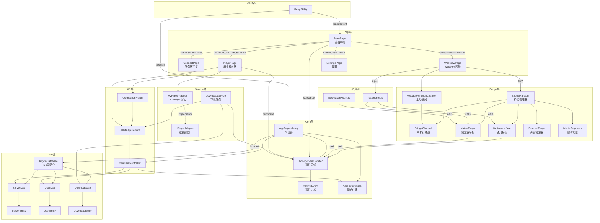
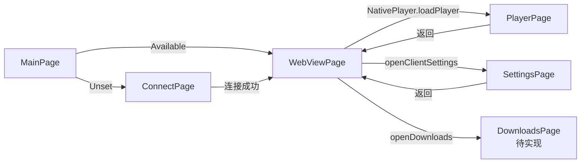
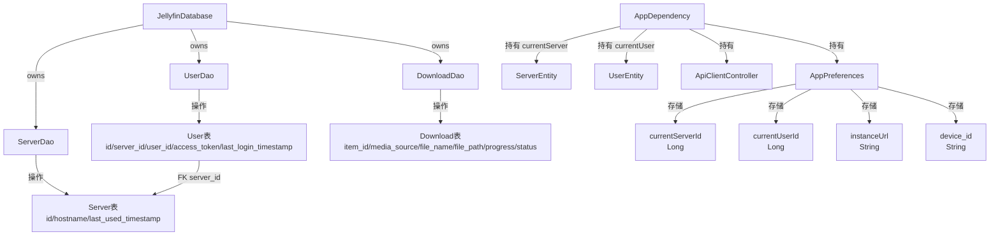
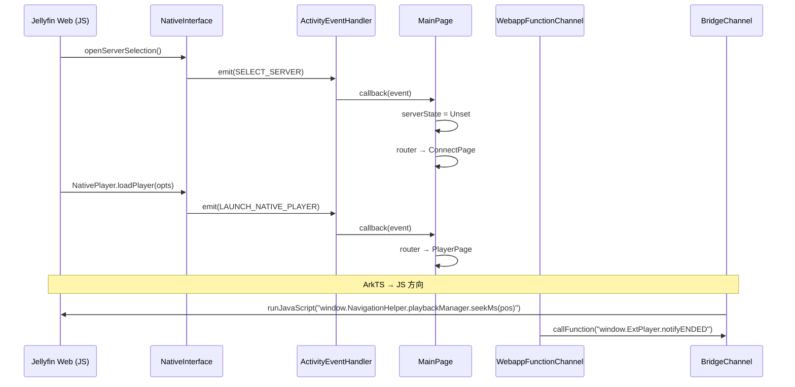

# Jellyfin HarmonyOS 模块依赖图

> 版本：1.0.0
> 日期：2026-03-22

---

## 一、整体模块依赖（Mermaid）



---

## 二、页面导航依赖图



---

## 三、数据层依赖图



---

## 四、事件流依赖图



---

## 五、Bridge 注册依赖

```
WebViewPage.onControllerAttached()
    └── BridgeManager.initialize()
            ├── BridgeChannel.initialize()
            │       └── WebviewController（引用）
            ├── NativeInterface(context, eventHandler, preferences)
            │       └── registerJavaScriptProxy("NativeInterface", [...14 methods])
            ├── NativePlayer(preferences, eventHandler)
            │       └── registerJavaScriptProxy("NativePlayer", [...9 methods])
            ├── ExternalPlayer(context, preferences)
            │       └── registerJavaScriptProxy("ExternalPlayer", [...2 methods])
            └── MediaSegments()
                    └── registerJavaScriptProxy("MediaSegments", [...2 methods])
```

**重要**：`registerJavaScriptProxy` 必须在 `Web` 组件的 `onControllerAttached` 回调中调用，且注册后需要调用 `controller.refresh()` 使代理生效。每次页面销毁重建（如从 PlayerPage 返回）需要重新注册。
